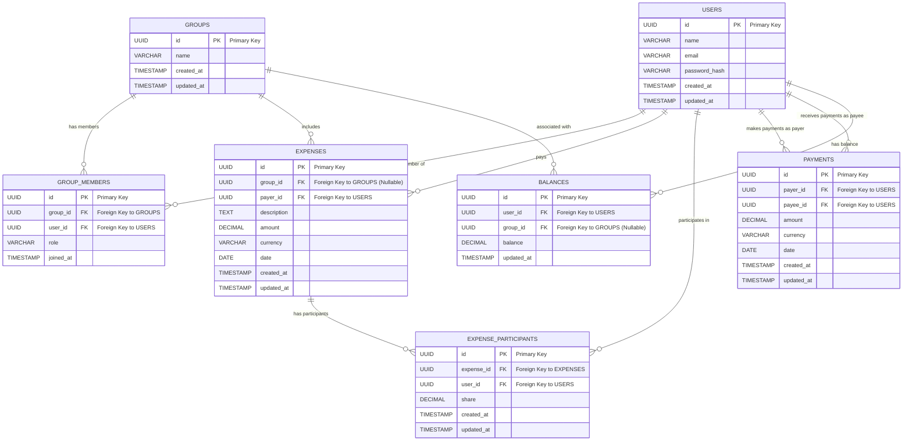

# The clearance db model

Subject to change

```mermaid
erDiagram
USERS {
UUID id PK "Primary Key"
VARCHAR name
VARCHAR email
VARCHAR password_hash
TIMESTAMP created_at
TIMESTAMP updated_at
}

    GROUPS {
        UUID id PK "Primary Key"
        VARCHAR name
        TIMESTAMP created_at
        TIMESTAMP updated_at
    }

    GROUP_MEMBERS {
        UUID id PK "Primary Key"
        UUID group_id FK "Foreign Key to GROUPS"
        UUID user_id FK "Foreign Key to USERS"
        VARCHAR role
        TIMESTAMP joined_at
    }

    EXPENSES {
        UUID id PK "Primary Key"
        UUID group_id FK "Foreign Key to GROUPS (Nullable)"
        UUID payer_id FK "Foreign Key to USERS"
        TEXT description
        DECIMAL amount
        VARCHAR currency
        DATE date
        TIMESTAMP created_at
        TIMESTAMP updated_at
    }

    EXPENSE_PARTICIPANTS {
        UUID id PK "Primary Key"
        UUID expense_id FK "Foreign Key to EXPENSES"
        UUID user_id FK "Foreign Key to USERS"
        DECIMAL share
        TIMESTAMP created_at
        TIMESTAMP updated_at
    }

    PAYMENTS {
        UUID id PK "Primary Key"
        UUID payer_id FK "Foreign Key to USERS"
        UUID payee_id FK "Foreign Key to USERS"
        DECIMAL amount
        VARCHAR currency
        DATE date
        TIMESTAMP created_at
        TIMESTAMP updated_at
    }

    BALANCES {
        UUID id PK "Primary Key"
        UUID user_id FK "Foreign Key to USERS"
        UUID group_id FK "Foreign Key to GROUPS (Nullable)"
        DECIMAL balance
        TIMESTAMP updated_at
    }

    %% Relationships
    USERS ||--o{ GROUP_MEMBERS : "is a member of"
    GROUPS ||--o{ GROUP_MEMBERS : "has members"

    USERS ||--o{ EXPENSES : "pays"
    GROUPS ||--o{ EXPENSES : "includes"
    EXPENSES ||--o{ EXPENSE_PARTICIPANTS : "has participants"
    USERS ||--o{ EXPENSE_PARTICIPANTS : "participates in"

    USERS ||--o{ PAYMENTS : "makes payments as payer"
    USERS ||--o{ PAYMENTS : "receives payments as payee"

    USERS ||--o{ BALANCES : "has balance"
    GROUPS ||--o{ BALANCES : "associated with"
```
